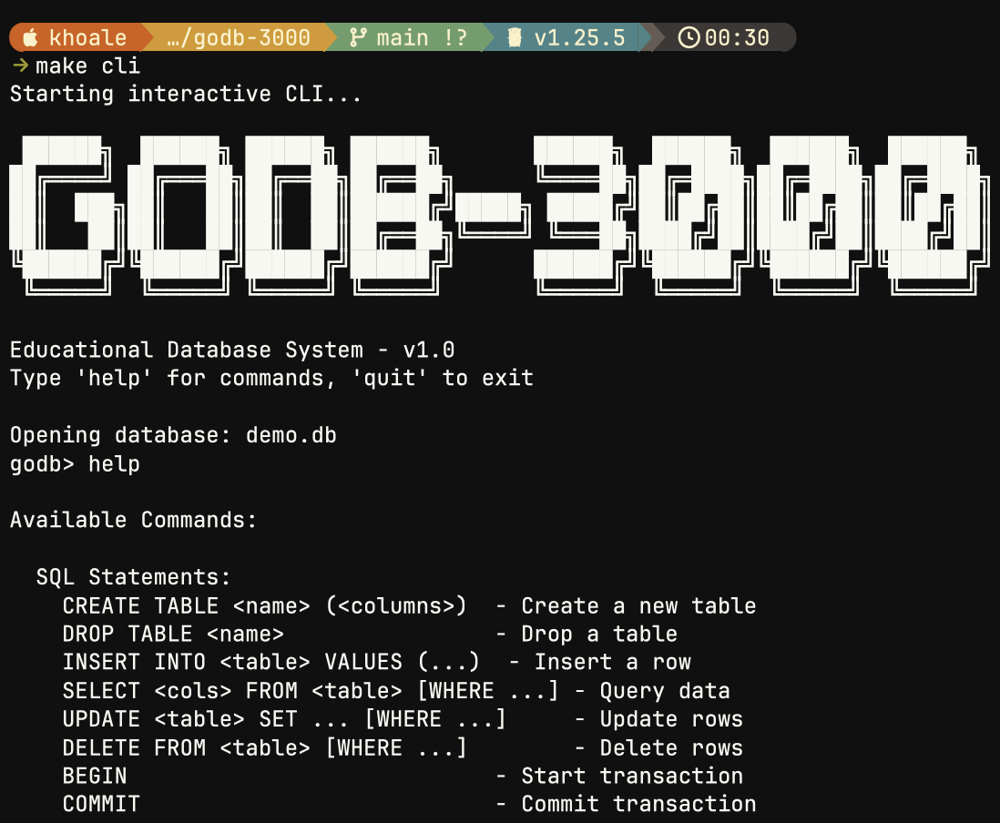

# GoDB-3000

A database implementation in Go with SQL support, transactions, and B+tree indexing.

## Requirements

- Go 1.21+

## Installation

```bash
git clone https://github.com/khoale/godb-3000.git
cd godb-3000
go mod download
```

## Quick Start

### Interactive CLI

```bash
make cli
# or
go run cmd/godb/main.go demo.db
```



### Basic Example

```go
package main

import (
    "fmt"
    "github.com/khoale/godb-3000/internal/kv"
    "github.com/khoale/godb-3000/internal/sql"
)

func main() {
    store, _ := kv.Open("mydb.db", kv.DefaultOptions())
    defer store.Close()

    executor := sql.NewExecutor(store)
    parser := sql.NewParser("CREATE TABLE users (id INT PRIMARY KEY, name STRING)")
    stmt, _ := parser.Parse()
    executor.Execute(stmt)

    parser = sql.NewParser("INSERT INTO users VALUES (1, 'Alice')")
    stmt, _ = parser.Parse()
    executor.Execute(stmt)

    parser = sql.NewParser("SELECT * FROM users")
    stmt, _ = parser.Parse()
    result, _ := executor.Execute(stmt)
    for _, row := range result.Rows {
        fmt.Println(row.Values)
    }
}
```

## Supported SQL Commands

### DDL
- `CREATE TABLE` - Create table with columns (INT, STRING, BYTES, BOOL, FLOAT)
- `DROP TABLE` - Delete table
- `CREATE INDEX` / `CREATE UNIQUE INDEX` - Create secondary index
- `DROP INDEX` - Delete index
- `SHOW TABLES` - List all tables

### DML
- `INSERT INTO table VALUES (...)` - Insert row
- `SELECT * FROM table [WHERE col op value]` - Query rows
- `UPDATE table SET col = value [WHERE ...]` - Update rows
- `DELETE FROM table [WHERE ...]` - Delete rows

### Transactions
- `BEGIN` - Start transaction
- `COMMIT` - Commit transaction
- `ROLLBACK` - Rollback transaction

### Utility
- `BACKUP TO 'path'` - Create database backup

## Project Structure

```
godb-3000/
├── internal/
│   ├── storage/      # Page-based storage engine
│   ├── btree/        # B+tree implementation
│   ├── kv/           # Key-value store
│   ├── table/        # Relational tables
│   ├── index/        # Secondary indexes
│   ├── transaction/  # Transaction management
│   ├── wal/          # Write-ahead logging
│   └── sql/          # SQL parser and executor
├── cmd/godb/         # CLI application
```

## Makefile Commands

```bash
make cli        # Start interactive CLI
make test       # Run tests
make build      # Build binaries
make examples   # Run examples
make clean      # Clean build artifacts
```
